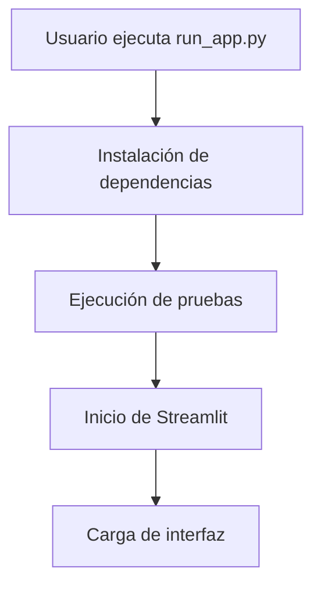
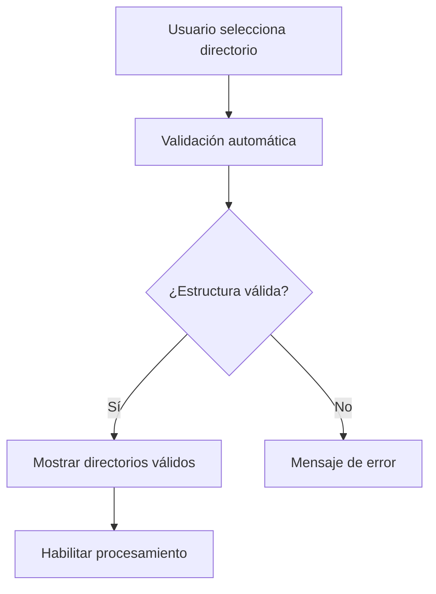
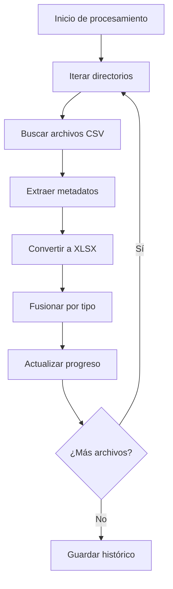
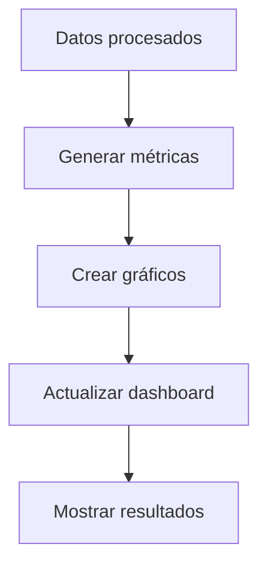

# Manual Técnico - Procesador de Datos Biométricos

## Índice

1. [Arquitectura del Sistema](#arquitectura-del-sistema)
2. [Estructura del Proyecto](#estructura-del-proyecto)
3. [Componentes Principales](#componentes-principales)
4. [Flujo de Datos](#flujo-de-datos)
5. [Sistema de Pruebas](#sistema-de-pruebas)
6. [Configuración y Despliegue](#configuración-y-despliegue)
7. [Mantenimiento y Debugging](#mantenimiento-y-debugging)

## Arquitectura del Sistema

### Arquitectura General

```
┌─────────────────┐    ┌─────────────────┐    ┌─────────────────┐
│   Interfaz      │    │   Procesamiento │    │   Almacenamiento │
│   Streamlit     │◄──►│   de Datos      │◄──►│   Histórico     │
│   (Frontend)    │    │   (Backend)     │    │   (JSON)        │
└─────────────────┘    └─────────────────┘    └─────────────────┘
         │                       │                       │
         ▼                       ▼                       ▼
┌─────────────────┐    ┌─────────────────┐    ┌─────────────────┐
│   Validación    │    │   Conversión    │    │   Visualización │
│   de Estructura │    │   CSV → XLSX    │    │   Plotly        │
└─────────────────┘    └─────────────────┘    └─────────────────┘
```

### Tecnologías Utilizadas

- **Frontend**: Streamlit 1.28.0+
- **Backend**: Python 3.8+
- **Procesamiento**: Pandas 2.0.0+
- **Visualización**: Plotly 5.15.0+
- **Pruebas**: Pytest 7.4.0+
- **Gestión de Estado**: Streamlit Session State

## Estructura del Proyecto

### Organización de Carpetas

```
app_convertion_ui/
├── run_app.py                    # Punto de entrada principal
├── requirements.txt              # Dependencias del proyecto
├── pytest.ini                   # Configuración de pruebas
├── __init__.py                  # Inicialización del paquete
│
├── src/                         # Código fuente principal
│   ├── app.py                  # Interfaz Streamlit
│   ├── data_processing.py      # Lógica de procesamiento
│   └── fusion_history.json     # Histórico de fusiones
│
├── docs/                        # Documentación
│   └── manuales/               # Manuales de usuario y técnico
│       ├── README.md           # Documentación principal
│       ├── user_manual.md      # Manual de usuario
│       └── tech_manual.md      # Este manual técnico
│
├── scripts/                     # Scripts de utilidad
│
├── tests/                       # Sistema de pruebas
│   ├── unit/                   # Pruebas unitarias
│   │   └── test_data_processing.py
│   └── functional/             # Pruebas funcionales
│       └── test_app_flow.py
│
├── test_reports/               # Reportes de pruebas
│   ├── test_report.html        # Reporte HTML principal
│   └── assets/
│       └── style.css           # Estilos del reporte
│
└── data/                       # Datos de ejemplo (sin mover)
    └── 2025-03-19-11-00-00/
        └── ...
```

### Archivos Clave

#### `run_app.py` (Punto de Entrada)

```python
# Ubicación: Raíz del proyecto
# Propósito: Script de inicio unificado
# Funciones:
# - Instalación automática de dependencias
# - Ejecución de pruebas
# - Inicio de la aplicación
```

#### `src/app.py` (Interfaz Principal)

```python
# Ubicación: src/app.py
# Propósito: Interfaz Streamlit
# Componentes:
# - Panel lateral de configuración
# - Dashboard principal
# - Sistema de progreso
# - Gestión de estado
```

#### `src/data_processing.py` (Lógica de Negocio)

```python
# Ubicación: src/data_processing.py
# Propósito: Procesamiento de datos
# Funciones:
# - Validación de estructura
# - Conversión CSV → XLSX
# - Fusión de archivos
# - Gestión de metadatos
```

## Componentes Principales

### 1. Interfaz de Usuario (Streamlit)

#### Panel Lateral

```python
# Componentes principales:
- st.sidebar: Contenedor principal
- select_directory(): Selección de directorio
- st.button(): Botones de acción
- st.info(): Mensajes informativos
```

#### Dashboard Principal

```python
# Estructura:
- st.tabs(): Pestañas organizativas
- st.metrics(): Métricas en tiempo real
- plotly_chart(): Gráficos interactivos
- st.progress(): Barra de progreso
```

#### Gestión de Estado

```python
# Variables de sesión:
- st.session_state.directorio_input
- st.session_state.directorios_validos
- st.session_state.procesando
- st.session_state.historico
```

### 2. Procesamiento de Datos

#### Validación de Estructura

```python
def validar_estructura_directorios(directorio_raiz):
    """
    Valida la estructura de directorios según el formato requerido:
    - Formato de fecha: YYYY-MM-DD-HH-MM-SS
    - Subcarpetas con archivos CSV
    - Metadatos en nombres de archivo
    """
```

#### Conversión de Archivos

```python
def convertir_csv_a_xlsx(archivo_csv, archivo_xlsx, metadatos):
    """
    Convierte archivo CSV a XLSX con metadatos:
    - Lee datos CSV con pandas
    - Añade hoja de metadatos
    - Guarda en formato XLSX
    """
```

#### Fusión de Datos

```python
def fusionar_archivos_por_tipo(directorio, tipo_dato):
    """
    Fusiona archivos del mismo tipo de dato:
    - Agrupa por tipo (PpgHrv, ProcessedMocap, etc.)
    - Combina datos en un solo archivo
    - Mantiene metadatos individuales
    """
```

### 3. Sistema de Histórico

#### Almacenamiento

```python
# Archivo: src/fusion_history.json
{
    "fecha": "2025-01-20T10:30:00",
    "directorio_procesado": "/path/to/data",
    "metricas": {
        "directorios_procesados": 15,
        "archivos_convertidos": 75,
        "archivos_fusionados": 5,
        "tiempo_total": 45.2
    },
    "archivos_procesados": [...],
    "errores": [...]
}
```

#### Gestión de Datos

```python
def cargar_historico():
    """Carga datos históricos desde JSON"""

def guardar_historico(datos):
    """Guarda nuevos datos en histórico"""

def limpiar_historico():
    """Elimina todos los datos históricos"""
```

## Flujo de Datos

### 1. Inicialización



### 2. Selección de Directorio



### 3. Procesamiento



### 4. Visualización



## Sistema de Pruebas

### Configuración

```ini
# pytest.ini
[tool:pytest]
testpaths = tests
python_files = test_*.py
python_classes = Test*
python_functions = test_*
addopts =
    --html=test_reports/test_report.html
    --self-contained-html
    --css=test_reports/assets/style.css
```

### Pruebas Unitarias

```python
# tests/unit/test_data_processing.py
class TestDataProcessing:
    def test_validar_estructura_directorios(self):
        """Prueba validación de estructura"""

    def test_extraer_metadatos(self):
        """Prueba extracción de metadatos"""

    def test_convertir_csv_a_xlsx(self):
        """Prueba conversión de archivos"""
```

### Pruebas Funcionales

```python
# tests/functional/test_app_flow.py
class TestAppFlow:
    def test_flujo_completo(self):
        """Prueba flujo completo de la aplicación"""

    def test_manejo_errores(self):
        """Prueba manejo de errores"""
```

### Ejecución de Pruebas

```bash
# Ejecutar todas las pruebas
pytest

# Ejecutar con cobertura
pytest --cov=src/data_processing tests/

# Ejecutar pruebas específicas
pytest tests/unit/
pytest tests/functional/
```

## Configuración y Despliegue

### Requisitos del Sistema

```python
# requirements.txt
streamlit>=1.28.0
pandas>=2.0.0
openpyxl>=3.1.0
plotly>=5.15.0
pytest>=7.4.0
pytest-html>=4.1.0
streamlit-extras>=0.3.0
```

### Variables de Entorno

```bash
# Configuración opcional
STREAMLIT_SERVER_PORT=8501
STREAMLIT_SERVER_ADDRESS=localhost
STREAMLIT_BROWSER_GATHER_USAGE_STATS=false
```

### Despliegue Local

```bash
# 1. Clonar repositorio
git clone <repository-url>
cd app_convertion_ui

# 2. Ejecutar aplicación
python run_app.py

# 3. Acceder a aplicación
# http://localhost:8501
```

### Despliegue en Producción

```bash
# Usando Streamlit Cloud o similar
# 1. Subir código a repositorio
# 2. Configurar variables de entorno
# 3. Desplegar automáticamente
```

## Mantenimiento y Debugging

### Logs y Debugging

#### Logs de Streamlit

```python
# Habilitar logs detallados
import logging
logging.basicConfig(level=logging.DEBUG)
```

#### Debugging de Interfaz

```python
# Verificar estado de sesión
st.write(st.session_state)

# Debug de componentes
st.write("Debug:", variable)
```

#### Debugging de Procesamiento

```python
# Logs de procesamiento
print(f"Procesando: {archivo}")
print(f"Metadatos: {metadatos}")
```

### Monitoreo de Rendimiento

#### Métricas de Tiempo

```python
import time

def medir_tiempo(funcion):
    def wrapper(*args, **kwargs):
        inicio = time.time()
        resultado = funcion(*args, **kwargs)
        fin = time.time()
        print(f"{funcion.__name__}: {fin - inicio:.2f}s")
        return resultado
    return wrapper
```

#### Uso de Memoria

```python
import psutil
import os

def monitorear_memoria():
    proceso = psutil.Process(os.getpid())
    return proceso.memory_info().rss / 1024 / 1024  # MB
```

### Optimización

#### Procesamiento en Lotes

```python
def procesar_en_lotes(archivos, tamano_lote=10):
    """Procesa archivos en lotes para optimizar memoria"""
    for i in range(0, len(archivos), tamano_lote):
        lote = archivos[i:i + tamano_lote]
        yield procesar_lote(lote)
```

#### Caché de Datos

```python
@st.cache_data
def cargar_datos_costosos():
    """Cachea datos costosos de cargar"""
    return pd.read_csv("datos_grandes.csv")
```

### Mantenimiento Preventivo

#### Limpieza de Archivos Temporales

```python
def limpiar_archivos_temporales():
    """Elimina archivos temporales generados"""
    import tempfile
    import shutil

    temp_dir = tempfile.gettempdir()
    # Limpiar archivos temporales específicos
```

#### Verificación de Integridad

```python
def verificar_integridad_sistema():
    """Verifica integridad de archivos y dependencias"""
    # Verificar archivos críticos
    # Verificar dependencias
    # Verificar permisos
```

### Actualizaciones

#### Gestión de Versiones

```python
# version.py
VERSION = "1.0.0"
BUILD_DATE = "2025-01-20"

def verificar_actualizaciones():
    """Verifica si hay actualizaciones disponibles"""
    # Lógica de verificación
```

#### Migración de Datos

```python
def migrar_historico_v1_a_v2():
    """Migra formato de histórico entre versiones"""
    # Lógica de migración
```

## Troubleshooting Avanzado

### Problemas de Rendimiento

- **Memoria insuficiente**: Procesar en lotes más pequeños
- **Tiempo de respuesta lento**: Optimizar consultas de datos
- **Interfaz no responsiva**: Reducir complejidad de gráficos

### Problemas de Compatibilidad

- **Versiones de Python**: Verificar compatibilidad
- **Dependencias**: Actualizar a versiones compatibles
- **Sistema operativo**: Verificar permisos y rutas

### Problemas de Datos

- **Archivos corruptos**: Implementar validación robusta
- **Formato incorrecto**: Añadir más validaciones
- **Metadatos faltantes**: Manejo de casos límite

---

**Este manual técnico proporciona información detallada para desarrolladores y administradores del sistema.**
