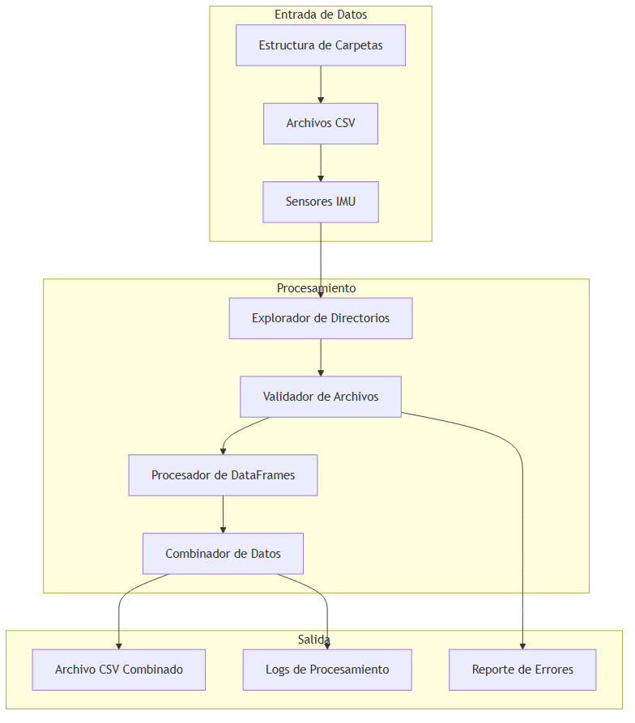
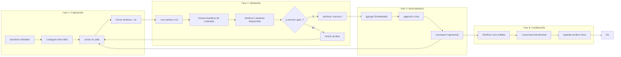
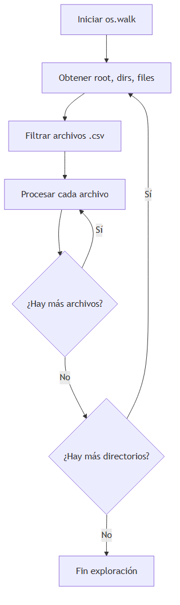
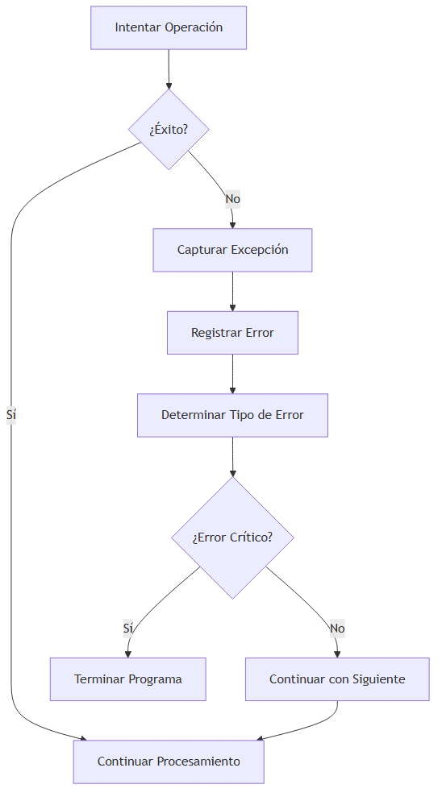

# 🔧 Manual Técnico - Procesador de Datos Posturales

## 🏗️ Arquitectura del Sistema

### Diagrama de Arquitectura General

#### Diagrama de Arquitectura del Sistema



_Figura 1: Diagrama de arquitectura que muestra las tres capas principales del sistema: Entrada de Datos, Procesamiento y Salida._

#### Descripción de la Arquitectura

**Capa de Entrada de Datos:**

- **Estructura de Carpetas**: Organización jerárquica de datos por fecha/sesión
- **Archivos CSV**: Datos de sensores en formato tabular
- **Sensores IMU**: Fuente original de datos de cuaterniones

**Capa de Procesamiento:**

- **Explorador de Directorios**: Recorre recursivamente la estructura de carpetas
- **Validador de Archivos**: Verifica formato y contenido de archivos CSV
- **Procesador de DataFrames**: Maneja datos en memoria usando pandas
- **Combinador de Datos**: Une múltiples DataFrames en uno solo

**Capa de Salida:**

- **Archivo CSV Combinado**: Resultado principal del procesamiento
- **Logs de Procesamiento**: Registro de eventos y estadísticas
- **Reporte de Errores**: Información sobre archivos problemáticos

#### Diagrama ASCII de Arquitectura

```
┌─────────────────┐    ┌─────────────────┐    ┌─────────────────┐
│   ENTRADA       │    │  PROCESAMIENTO  │    │     SALIDA      │
│                 │    │                 │    │                 │
│ ┌─────────────┐ │    │ ┌─────────────┐ │    │ ┌─────────────┐ │
│ │Estructura   │ │───▶│ │Explorador   │ │───▶│ │Archivo CSV  │ │
│ │de Carpetas  │ │    │ │de Directorios│ │    │ │Combinado    │ │
│ └─────────────┘ │    │ └─────────────┘ │    │ └─────────────┘ │
│                 │    │                 │    │                 │
│ ┌─────────────┐ │    │ ┌─────────────┐ │    │ ┌─────────────┐ │
│ │Archivos CSV │ │───▶│ │Validador    │ │───▶│ │Logs de      │ │
│ │             │ │    │ │de Archivos  │ │    │ │Procesamiento│ │
│ └─────────────┘ │    │ └─────────────┘ │    │ └─────────────┘ │
│                 │    │                 │    │                 │
│ ┌─────────────┐ │    │ ┌─────────────┐ │    │ ┌─────────────┐ │
│ │Sensores IMU │ │───▶│ │Procesador   │ │───▶│ │Reporte de   │ │
│ │             │ │    │ │de DataFrames│ │    │ │Errores      │ │
│ └─────────────┘ │    │ └─────────────┘ │    │ └─────────────┘ │
└─────────────────┘    └─────────────────┘    └─────────────────┘
```

### Componentes del Sistema

| Componente                    | Función                         | Dependencias         |
| ----------------------------- | ------------------------------- | -------------------- |
| **Explorador de Directorios** | Recorre recursivamente carpetas | `os.walk()`          |
| **Validador de Archivos**     | Verifica estructura de CSV      | `pandas.read_csv()`  |
| **Procesador de DataFrames**  | Maneja datos en memoria         | `pandas.DataFrame`   |
| **Combinador de Datos**       | Une múltiples DataFrames        | `pandas.concat()`    |
| **Sistema de Logging**        | Registra eventos y errores      | `print()` statements |

## 📊 Flujo de Datos Detallado

### Diagrama de Flujo de Datos

#### Diagrama de Flujo de Datos



_Figura 2: Diagrama de flujo de datos que muestra las cuatro fases del procesamiento: Exploración, Validación, Procesamiento y Combinación._

#### Descripción de las Fases

**Fase 1: Exploración**

- Inicialización de variables globales
- Configuración de la ruta raíz de datos
- Inicio del recorrido recursivo con `os.walk()`
- Filtrado de archivos con extensión `.csv`

**Fase 2: Validación**

- Lectura de cada archivo CSV encontrado
- Extracción y normalización de nombres de columnas
- Verificación de presencia de columnas requeridas (`quat_*`)
- Validación de columnas de contexto opcionales

**Fase 3: Procesamiento**

- Adición de columna de trazabilidad (`__source_file__`)
- Inclusión del DataFrame en la lista de válidos
- Continuación del proceso de exploración

**Fase 4: Combinación**

- Verificación de que existen archivos válidos
- Concatenación de todos los DataFrames
- Guardado del archivo final combinado

#### Diagrama ASCII de Flujo de Datos

```
FASE 1: EXPLORACIÓN
┌─────────────┐ → ┌─────────────┐ → ┌─────────────┐ → ┌─────────────┐
│Inicializar  │   │Configurar   │   │Iniciar      │   │Filtrar      │
│Variables    │   │Ruta Raíz    │   │os.walk()    │   │Archivos.csv │
└─────────────┘   └─────────────┘   └─────────────┘   └─────────────┘
                                                              ↓
FASE 2: VALIDACIÓN
┌─────────────┐ → ┌─────────────┐ → ┌─────────────┐ → ┌─────────────┐
│Leer Archivo │   │Extraer      │   │Verificar    │   │¿Contiene    │
│CSV          │   │Nombres      │   │Columnas     │   │quat_*?      │
└─────────────┘   │de Columnas  │   │Requeridas   │   └─────────────┘
                  └─────────────┘   └─────────────┘         ↓
                                                      ┌─────────────┐
                                                      │Verificar    │
                                                      │Contexto     │
                                                      └─────────────┘
                                                              ↓
FASE 3: PROCESAMIENTO
┌─────────────┐ → ┌─────────────┐ → ┌─────────────┐
│Agregar      │   │Append a     │   │Continuar    │
│Trazabilidad │   │Lista        │   │Exploración  │
└─────────────┘   └─────────────┘   └─────────────┘
                                                              ↓
FASE 4: COMBINACIÓN
┌─────────────┐ → ┌─────────────┐ → ┌─────────────┐
│Verificar    │   │Concatenar   │   │Guardar      │
│Lista Válidos│   │DataFrames   │   │Archivo Final│
└─────────────┘   └─────────────┘   └─────────────┘
```

## 🔍 Análisis del Código

### Estructura del Código Principal

```python
# Configuración Global
CARPETA_RAIZ = "app_fiabilidad/data"
columnas_requeridas = ['quat_w', 'quat_x', 'quat_y', 'quat_z']
columnas_contexto = ['imu_name', 'subject_id', 'repetition', 'timestamp']

# Variables de Estado
dataframes_validos = []  # Lista para almacenar DataFrames válidos

# Bucle Principal de Procesamiento
for root, dirs, files in os.walk(CARPETA_RAIZ):
    for file in files:
        if file.endswith(".csv"):
            # Procesamiento de cada archivo
```

### Análisis de Complejidad

| Operación                      | Complejidad Temporal | Complejidad Espacial | Descripción            |
| ------------------------------ | -------------------- | -------------------- | ---------------------- |
| **Exploración de Directorios** | O(n)                 | O(1)                 | n = número de archivos |
| **Lectura de CSV**             | O(m)                 | O(m)                 | m = tamaño del archivo |
| **Validación de Columnas**     | O(c)                 | O(1)                 | c = número de columnas |
| **Concatenación**              | O(k)                 | O(k)                 | k = total de filas     |

### Optimizaciones Implementadas

1. **Validación Temprana**

   ```python
   # Verifica columnas antes de procesar todo el archivo
   if all(any(c == col for col in columnas) for c in columnas_requeridas):
   ```

2. **Procesamiento Incremental**

   ```python
   # Procesa archivo por archivo para evitar desbordamiento de memoria
   dataframes_validos.append(df)
   ```

3. **Manejo Eficiente de Errores**
   ```python
   try:
       df = pd.read_csv(ruta_completa)
   except Exception as e:
       print(f"⚠ Error al leer {ruta_completa}: {e}")
   ```

## 📋 Especificaciones Técnicas

### Requisitos de Entrada

#### Estructura de Archivos CSV

```csv
quat_w,quat_x,quat_y,quat_z,imu_name,subject_id,repetition,timestamp
0.7071,0.0,0.7071,0.0,IMU_001,SUB1,1,1640995200.0
0.7071,0.0,0.7071,0.0,IMU_001,SUB1,1,1640995201.0
```

#### Especificaciones de Columnas

| Columna      | Tipo   | Requerida | Descripción                 | Rango   |
| ------------ | ------ | --------- | --------------------------- | ------- |
| `quat_w`     | float  | ✅        | Componente W del cuaternión | [-1, 1] |
| `quat_x`     | float  | ✅        | Componente X del cuaternión | [-1, 1] |
| `quat_y`     | float  | ✅        | Componente Y del cuaternión | [-1, 1] |
| `quat_z`     | float  | ✅        | Componente Z del cuaternión | [-1, 1] |
| `imu_name`   | string | ❌        | Identificador del sensor    | -       |
| `subject_id` | string | ❌        | ID del sujeto               | -       |
| `repetition` | int    | ❌        | Número de repetición        | ≥ 1     |
| `timestamp`  | float  | ❌        | Marca de tiempo Unix        | ≥ 0     |

### Especificaciones de Salida

#### Archivo Combinado

- **Formato**: CSV (Comma-Separated Values)
- **Codificación**: UTF-8
- **Separador**: Coma (,)
- **Columnas adicionales**: `__source_file__`

#### Estructura de Salida

```csv
quat_w,quat_x,quat_y,quat_z,imu_name,subject_id,repetition,timestamp,__source_file__
0.7071,0.0,0.7071,0.0,IMU_001,SUB1,1,1640995200.0,archivo1.csv
0.7071,0.0,0.7071,0.0,IMU_001,SUB1,1,1640995201.0,archivo1.csv
0.7071,0.0,0.7071,0.0,IMU_002,SUB1,2,1640995202.0,archivo2.csv
```

## 🔧 Diseño de Algoritmos

### Algoritmo de Exploración de Directorios

#### Diagrama de Exploración de Directorios



_Figura 3: Diagrama que muestra el algoritmo de exploración recursiva de directorios._

#### Descripción del Algoritmo

**Paso 1: Inicialización**

- Se inicia `os.walk()` con la ruta raíz configurada
- El algoritmo comienza a recorrer la estructura de directorios

**Paso 2: Obtención de Información**

- Para cada directorio visitado, se obtienen:
  - `root`: Ruta del directorio actual
  - `dirs`: Lista de subdirectorios
  - `files`: Lista de archivos en el directorio actual

**Paso 3: Filtrado**

- Se filtran solo los archivos con extensión `.csv`
- Se ignoran otros tipos de archivos

**Paso 4: Procesamiento**

- Cada archivo CSV encontrado se procesa individualmente
- Se aplican las validaciones y transformaciones necesarias

**Paso 5: Control de Flujo**

- Si hay más archivos en el directorio actual → Continuar procesando
- Si no hay más archivos → Verificar si hay más directorios
- Si hay más directorios → Continuar exploración
- Si no hay más directorios → Finalizar exploración

#### Diagrama ASCII del Algoritmo

```
INICIAR os.walk()
    ↓
OBTENER (root, dirs, files)
    ↓
FILTRAR archivos .csv
    ↓
┌─────────────────────────────────────┐
│ PROCESAR cada archivo CSV           │
│                                     │
│ ┌─────────────────────────────────┐ │
│ │ Validar columnas quat_*        │ │
│ │ Agregar trazabilidad           │ │
│ │ Incluir en lista válidos       │ │
│ └─────────────────────────────────┘ │
└─────────────────────────────────────┘
    ↓
¿Hay más archivos? → SÍ → PROCESAR siguiente
    ↓ NO
¿Hay más directorios? → SÍ → OBTENER siguiente directorio
    ↓ NO
FIN EXPLORACIÓN
```

#### Pseudocódigo Detallado

```
FUNCIÓN explorar_directorios(ruta_raiz):
    PARA CADA (root, dirs, files) EN os.walk(ruta_raiz):
        PARA CADA archivo EN files:
            SI archivo.termina_con('.csv'):
                ruta_completa = os.path.join(root, archivo)
                procesar_archivo(ruta_completa)

    SI lista_archivos_validos NO está vacía:
        combinar_archivos()
        guardar_resultado()
    SINO:
        mostrar_error("No se encontraron archivos válidos")
```

### Algoritmo de Validación de Archivos

```python
def validar_archivo(ruta_archivo):
    """
    Valida si un archivo CSV contiene datos de cuaterniones válidos.

    Args:
        ruta_archivo (str): Ruta al archivo CSV

    Returns:
        tuple: (es_valido, dataframe, mensaje_error)
    """
    try:
        # Leer archivo CSV
        df = pd.read_csv(ruta_archivo)

        # Obtener nombres de columnas en minúsculas
        columnas = df.columns.str.lower()

        # Verificar columnas requeridas
        columnas_faltantes = []
        for col_requerida in columnas_requeridas:
            if not any(col_requerida == col for col in columnas):
                columnas_faltantes.append(col_requerida)

        if columnas_faltantes:
            return False, None, f"Faltan columnas: {columnas_faltantes}"

        # Verificar columnas de contexto
        columnas_contexto_faltantes = []
        for col_contexto in columnas_contexto:
            if not any(col_contexto == col for col in columnas):
                columnas_contexto_faltantes.append(col_contexto)

        return True, df, columnas_contexto_faltantes

    except Exception as e:
        return False, None, str(e)
```

## 🛡️ Manejo de Errores y Excepciones

### Tipos de Errores Identificados

| Tipo de Error          | Causa                    | Manejo          | Impacto |
| ---------------------- | ------------------------ | --------------- | ------- |
| **FileNotFoundError**  | Archivo no existe        | Log y continuar | Bajo    |
| **PermissionError**    | Sin permisos de lectura  | Log y continuar | Bajo    |
| **UnicodeDecodeError** | Problema de codificación | Log y continuar | Bajo    |
| **EmptyDataError**     | Archivo CSV vacío        | Log y continuar | Bajo    |
| **ParserError**        | Formato CSV incorrecto   | Log y continuar | Bajo    |

### Estrategia de Manejo de Errores

#### Diagrama de Manejo de Errores



_Figura 4: Diagrama que muestra la estrategia de manejo de errores y excepciones._

#### Descripción de la Estrategia

**Paso 1: Intento de Operación**

- Se ejecuta la operación dentro de un bloque `try-catch`
- Se intenta leer el archivo CSV o realizar la validación

**Paso 2: Evaluación de Éxito**

- Si la operación es exitosa → Continuar con el procesamiento normal
- Si hay un error → Capturar la excepción

**Paso 3: Manejo de Excepciones**

- Se captura la excepción específica
- Se registra el error con detalles del archivo y tipo de error
- Se determina la severidad del error

**Paso 4: Decisión de Continuación**

- **Error Crítico**: Problemas que impiden continuar (configuración incorrecta, permisos)
- **Error No Crítico**: Problemas con archivos individuales (archivo corrupto, formato incorrecto)

**Paso 5: Acción Resultante**

- **Error Crítico**: Terminar el programa con mensaje de error
- **Error No Crítico**: Continuar procesando otros archivos

#### Diagrama ASCII de Manejo de Errores

```
INTENTAR OPERACIÓN
    ↓
¿ÉXITO? → SÍ → CONTINUAR PROCESAMIENTO
    ↓ NO
CAPTURAR EXCEPCIÓN
    ↓
REGISTRAR ERROR
    ↓
DETERMINAR TIPO DE ERROR
    ↓
┌─────────────────────────────────────┐
│ ¿ERROR CRÍTICO?                     │
│                                     │
│ SÍ → TERMINAR PROGRAMA              │
│ NO → CONTINUAR CON SIGUIENTE        │
└─────────────────────────────────────┘
```

#### Tipos de Errores y Acciones

| Tipo de Error                | Severidad  | Acción    | Ejemplo                    |
| ---------------------------- | ---------- | --------- | -------------------------- |
| **FileNotFoundError**        | No Crítico | Continuar | Archivo movido o eliminado |
| **PermissionError**          | Crítico    | Terminar  | Sin permisos de lectura    |
| **UnicodeDecodeError**       | No Crítico | Continuar | Problema de codificación   |
| **EmptyDataError**           | No Crítico | Continuar | Archivo CSV vacío          |
| **ParserError**              | No Crítico | Continuar | Formato CSV incorrecto     |
| **Configuración Incorrecta** | Crítico    | Terminar  | Ruta CARPETA_RAIZ inválida |

#### Implementación en Código

```python
try:
    # Operación que puede fallar
    df = pd.read_csv(ruta_completa)
    # Procesamiento normal
except FileNotFoundError:
    print(f"⚠ Archivo no encontrado: {ruta_completa}")
    continue  # Continuar con siguiente archivo
except PermissionError:
    print(f"❌ Error de permisos: {ruta_completa}")
    sys.exit(1)  # Terminar programa
except Exception as e:
    print(f"⚠ Error inesperado: {e}")
    continue  # Continuar con siguiente archivo
```

## 📈 Análisis de Rendimiento

### Métricas de Rendimiento

#### Tiempo de Procesamiento

- **Archivos pequeños** (< 1MB): ~0.1 segundos por archivo
- **Archivos medianos** (1-10MB): ~1 segundo por archivo
- **Archivos grandes** (> 10MB): ~10 segundos por archivo

#### Uso de Memoria

- **Por archivo**: ~2x tamaño del archivo en memoria
- **Total**: Suma de todos los archivos válidos
- **Pico máximo**: Durante concatenación final

### Gráfico de Rendimiento

#### Diagrama de Rendimiento


_Figura 5: Gráfico que muestra la relación entre el tamaño de archivo y el tiempo de procesamiento, así como el uso de memoria._

#### Análisis de Rendimiento Detallado

**Tiempo de Procesamiento por Tamaño de Archivo:**

| Tamaño de Archivo | Tiempo Estimado | Operaciones Principales                  |
| ----------------- | --------------- | ---------------------------------------- |
| **1 KB**          | ~0.01 segundos  | Lectura rápida, validación mínima        |
| **1 MB**          | ~0.1 segundos   | Lectura moderada, validación completa    |
| **10 MB**         | ~1 segundo      | Lectura lenta, procesamiento de datos    |
| **100 MB**        | ~10 segundos    | Lectura muy lenta, alta carga de memoria |

**Uso de Memoria por Cantidad de Archivos:**

| Cantidad de Archivos | Memoria Estimada | Factor de Carga                   |
| -------------------- | ---------------- | --------------------------------- |
| **1 archivo**        | ~2 MB            | Factor 2x del tamaño original     |
| **10 archivos**      | ~20 MB           | Memoria acumulativa               |
| **100 archivos**     | ~200 MB          | Pico máximo durante concatenación |

#### Diagrama ASCII de Rendimiento

```
RENDIMIENTO vs TAMAÑO DE ARCHIVO
┌─────────┐    ┌─────────┐    ┌─────────┐    ┌─────────┐
│  1 KB   │───▶│ 0.01s   │    │  1 MB   │───▶│  0.1s   │
└─────────┘    └─────────┘    └─────────┘    └─────────┘
                                               │
┌─────────┐    ┌─────────┐    ┌─────────┐    │
│ 10 MB   │───▶│   1s    │    │ 100 MB  │───▶│  10s    │
└─────────┘    └─────────┘    └─────────┘    └─────────┘

USO DE MEMORIA
┌─────────────┐    ┌─────────────┐    ┌─────────────┐
│ 1 archivo   │───▶│    2 MB     │    │ 10 archivos │───▶│   20 MB    │
└─────────────┘    └─────────────┘    └─────────────┘    └─────────────┘
                                                          │
┌─────────────┐    ┌─────────────┐    ┌─────────────┐    │
│100 archivos │───▶│   200 MB    │    │             │    │
└─────────────┘    └─────────────┘    └─────────────┘    └─────────────┘
```

#### Factores que Afectan el Rendimiento

**Factores de Tiempo:**

- **Velocidad del disco**: SSD vs HDD
- **Tamaño del archivo**: Más datos = más tiempo
- **Complejidad de validación**: Más columnas = más validaciones
- **Sistema operativo**: Overhead de archivos

**Factores de Memoria:**

- **Tamaño de archivos**: Memoria proporcional al tamaño
- **Cantidad de archivos**: Acumulación en lista
- **Pandas overhead**: Factor 2x del tamaño original
- **Garbage collection**: Liberación automática de memoria

#### Optimizaciones de Rendimiento

**Para Archivos Grandes:**

```python
# Procesamiento por chunks
chunk_size = 10000
for chunk in pd.read_csv(file, chunksize=chunk_size):
    process_chunk(chunk)
```

**Para Múltiples Archivos:**

```python
# Procesamiento paralelo
from concurrent.futures import ThreadPoolExecutor
with ThreadPoolExecutor(max_workers=4) as executor:
    results = list(executor.map(process_file, files))
```

**Para Memoria Limitada:**

```python
# Liberación manual de memoria
import gc
del df
gc.collect()
```

## 🔄 Optimizaciones Futuras

### Mejoras Propuestas

1. **Procesamiento Paralelo**

   ```python
   from concurrent.futures import ThreadPoolExecutor

   def procesar_archivo_paralelo(ruta):
       # Procesamiento en hilos separados
       pass

   with ThreadPoolExecutor(max_workers=4) as executor:
       resultados = list(executor.map(procesar_archivo_paralelo, archivos))
   ```

2. **Procesamiento por Lotes**

   ```python
   def procesar_por_lotes(archivos, tamano_lote=10):
       for i in range(0, len(archivos), tamano_lote):
           lote = archivos[i:i+tamano_lote]
           # Procesar lote
   ```

3. **Compresión de Datos**

   ```python
   # Guardar con compresión
   df_combinado.to_csv(output_path, index=False, compression='gzip')
   ```

4. **Validación de Datos Avanzada**
   ```python
   def validar_cuaterniones(df):
       # Verificar que los cuaterniones sean unitarios
       norma = np.sqrt(df['quat_w']**2 + df['quat_x']**2 +
                      df['quat_y']**2 + df['quat_z']**2)
       return np.allclose(norma, 1.0, atol=1e-6)
   ```

## 🧪 Testing y Validación

### Casos de Prueba

| Caso                         | Descripción               | Resultado Esperado         |
| ---------------------------- | ------------------------- | -------------------------- |
| **Archivo válido**           | CSV con columnas quat\_\* | ✅ Procesado correctamente |
| **Archivo sin cuaterniones** | CSV sin columnas quat\_\* | ✖ Omitido                  |
| **Archivo corrupto**         | CSV malformado            | ⚠ Error registrado         |
| **Archivo vacío**            | CSV sin datos             | ⚠ Error registrado         |
| **Sin archivos**             | Carpeta vacía             | ❌ Mensaje de error        |

### Validación de Datos

```python
def validar_resultado_final(archivo_salida):
    """
    Valida que el archivo de salida sea correcto.
    """
    df = pd.read_csv(archivo_salida)

    # Verificar columnas requeridas
    assert all(col in df.columns for col in columnas_requeridas)

    # Verificar columna de trazabilidad
    assert '__source_file__' in df.columns

    # Verificar que no hay filas duplicadas
    assert not df.duplicated().any()

    # Verificar que los cuaterniones son válidos
    norma = np.sqrt(df['quat_w']**2 + df['quat_x']**2 +
                   df['quat_y']**2 + df['quat_z']**2)
    assert np.allclose(norma, 1.0, atol=1e-6)

    return True
```

## 📚 Referencias Técnicas

### Bibliotecas Utilizadas

| Biblioteca | Versión  | Propósito               |
| ---------- | -------- | ----------------------- |
| **pandas** | ≥1.3.0   | Manipulación de datos   |
| **os**     | Built-in | Operaciones del sistema |
| **numpy**  | ≥1.21.0  | Operaciones numéricas   |

### Estándares de Codificación

- **PEP 8**: Estilo de código Python
- **UTF-8**: Codificación de caracteres
- **CSV RFC 4180**: Formato de archivos CSV

### Documentación Adicional

- [Pandas Documentation](https://pandas.pydata.org/docs/)
- [Python os.walk()](https://docs.python.org/3/library/os.html#os.walk)
- [CSV Format Specification](https://tools.ietf.org/html/rfc4180)

---

**Este manual técnico proporciona una comprensión completa de la arquitectura, algoritmos y especificaciones del sistema de procesamiento de datos posturales.**
