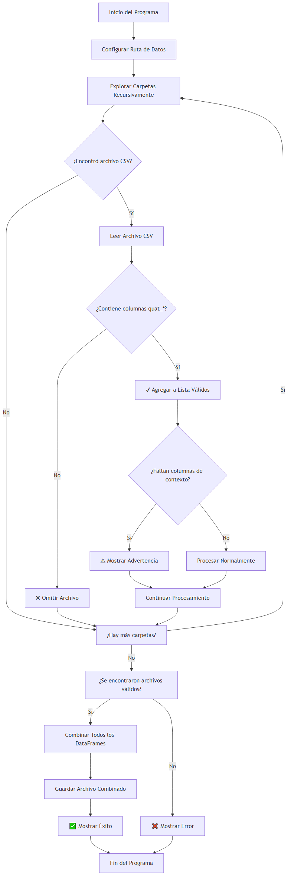

# 📖 Manual de Usuario - Procesador de Datos Posturales

## 🎯 ¿Qué hace este programa?

Este programa está diseñado para **procesar automáticamente** archivos CSV que contienen datos de sensores IMU (Inertial Measurement Units) y combinar todos los datos válidos en un solo archivo. Es especialmente útil para investigadores que trabajan con datos posturales y biomecánicos.

### 🔍 Problema que resuelve

- **Antes**: Tener que abrir manualmente cientos de archivos CSV
- **Después**: Un solo comando procesa todos los archivos automáticamente

## 📋 Requisitos del Sistema

### Software Necesario

- ✅ **Python 3.7 o superior**
- ✅ **Pandas** (biblioteca de análisis de datos)
- ✅ **Sistema operativo**: Windows, macOS o Linux

### Estructura de Datos Requerida

```
📁 Tu_Carpeta_Proyecto/
├── 📁 data/
│   ├── 📁 2025-03-19-11-00-00/
│   │   ├── 📁 Scene Capture - SUB1 - S1 - T1 - CC - OK/
│   │   │   ├── 📄 archivo1.csv
│   │   │   └── 📄 archivo2.csv
│   │   └── 📁 Scene Capture - SUB1 - S1 - T2 - CC - OK/
│   │       └── 📄 archivo3.csv
│   └── 📁 2025-03-20-11-00-00/
│       └── ...
└── 📄 main.py
```

## 🚀 Instalación Paso a Paso

### Paso 1: Verificar Python

Abre una terminal y ejecuta:

```bash
python --version
```

**Resultado esperado**: `Python 3.7.x` o superior

### Paso 2: Instalar Pandas

```bash
pip install pandas
```

### Paso 3: Descargar el Script

- Descarga `main.py` en tu carpeta de trabajo
- Asegúrate de que esté en la misma carpeta que tu carpeta `data`

## ⚙️ Configuración

### Paso 1: Abrir el Script

Abre el archivo `main.py` con cualquier editor de texto (Notepad++, VS Code, etc.)

### Paso 2: Configurar la Ruta

Busca esta línea:

```python
CARPETA_RAIZ = "/data"  # ← AJUSTAR ESTA RUTA
```

Cámbiala por la ruta correcta a tu carpeta de datos:

```python
CARPETA_RAIZ = "data"  # Si está en la misma carpeta
# O
CARPETA_RAIZ = "C:/ruta/completa/a/tu/carpeta/data"  # Ruta absoluta
```

### Paso 3: Guardar Cambios

Guarda el archivo `main.py`

## ▶️ Ejecución del Programa

### Método 1: Terminal/Línea de Comandos

1. Abre una terminal
2. Navega hasta la carpeta del proyecto:
   ```bash
   cd ruta/a/tu/proyecto
   ```
3. Ejecuta el script:
   ```bash
   python main.py
   ```

### Método 2: IDE

Si usas un IDE como PyCharm, VS Code, etc.:

1. Abre el archivo `main.py`
2. Presiona el botón de "Run" o "Ejecutar"

## 📊 Flujo de Trabajo del Programa

### Diagrama de Flujo del Programa



_Figura 1: Diagrama de flujo que muestra el proceso completo del programa desde la inicialización hasta la finalización._

### Descripción Textual del Flujo

**Fase 1: Inicialización**

1. El programa inicia y configura la ruta de datos
2. Comienza a explorar carpetas recursivamente

**Fase 2: Exploración y Validación** 3. Para cada archivo CSV encontrado:

- Lee el archivo
- Verifica si contiene columnas `quat_w`, `quat_x`, `quat_y`, `quat_z`
- Si NO las contiene → Omite el archivo
- Si las contiene → Continúa al paso 4

**Fase 3: Procesamiento** 4. Para archivos válidos:

- Verifica si faltan columnas de contexto opcionales
- Si faltan → Muestra advertencia pero continúa
- Agrega el archivo a la lista de válidos
- Continúa explorando

**Fase 4: Finalización** 5. Al terminar la exploración:

- Si se encontraron archivos válidos → Los combina
- Si NO se encontraron → Muestra error
- Guarda el archivo combinado
- Muestra mensaje de éxito

### Diagrama ASCII Alternativo

```
INICIO → CONFIGURAR RUTA → EXPLORAR CARPETAS
    ↓
¿Encontró CSV? → NO → ¿Más carpetas? → SÍ → EXPLORAR CARPETAS
    ↓ SÍ                                    ↓ NO
LEER CSV → ¿Tiene quat_*? → NO → OMITIR → ¿Más carpetas?
    ↓ SÍ
¿Falta contexto? → SÍ → ADVERTENCIA
    ↓ NO
AGREGAR A VÁLIDOS → ¿Más carpetas?
    ↓ NO
¿Hay archivos válidos? → NO → ERROR
    ↓ SÍ
COMBINAR → GUARDAR → ÉXITO → FIN
```

## 📈 Interpretación de Resultados

### Mensajes en Consola

| Símbolo | Significado                                     | Acción Requerida                              |
| ------- | ----------------------------------------------- | --------------------------------------------- |
| ✔       | **Archivo procesado exitosamente**              | Ninguna - continuar                           |
| ✖       | **Archivo omitido** (sin datos de cuaterniones) | Verificar contenido del archivo               |
| ⚠       | **Advertencia** (falta contexto)                | Opcional - revisar si necesitas esas columnas |
| ⚠       | **Error de lectura**                            | Verificar si el archivo está corrupto         |
| ✅      | **Proceso completado**                          | Revisar archivo de salida                     |
| ❌      | **No se encontraron archivos**                  | Verificar ruta en CARPETA_RAIZ                |

### Archivo de Salida

**Ubicación**: `data/archivo_postural_combinado.csv`

**Contenido**:

- Todas las columnas de los archivos originales
- Nueva columna `__source_file__` que indica el archivo de origen
- Datos ordenados cronológicamente (si hay timestamps)

## 🔍 Verificación de Resultados

### Paso 1: Verificar que se Creó el Archivo

Busca en tu carpeta de datos el archivo:

```
📄 archivo_postural_combinado.csv
```

### Paso 2: Abrir el Archivo

Puedes abrirlo con:

- **Excel** (doble clic)
- **Google Sheets** (subir el archivo)
- **Python** (para análisis adicional)

### Paso 3: Verificar el Contenido

El archivo debe contener:

- ✅ Todas las columnas de cuaterniones (`quat_w`, `quat_x`, `quat_y`, `quat_z`)
- ✅ Columna `__source_file__` con nombres de archivos originales
- ✅ Datos de todos los archivos procesados

## 🛠️ Solución de Problemas Comunes

### Problema 1: "❌ No se encontraron archivos con datos relevantes"

**Causas posibles**:

- Ruta incorrecta en `CARPETA_RAIZ`
- Archivos CSV no contienen columnas `quat_*`
- Archivos están en formato diferente

**Solución**:

1. Verificar que la ruta en `CARPETA_RAIZ` sea correcta
2. Abrir un archivo CSV y verificar que tenga columnas como `quat_w`, `quat_x`, etc.
3. Asegurarse de que los archivos tengan extensión `.csv`

### Problema 2: "⚠ Error al leer [archivo]"

**Causas posibles**:

- Archivo corrupto
- Archivo abierto en otro programa
- Problemas de codificación

**Solución**:

1. Cerrar el archivo si está abierto en Excel u otro programa
2. Verificar que el archivo no esté corrupto
3. Intentar abrir el archivo manualmente

### Problema 3: "⚠ Archivo cargado pero faltan columnas de contexto"

**Explicación**:

- El archivo se procesó correctamente
- Solo faltan columnas opcionales como `imu_name`, `subject_id`, etc.
- **No es un error** - el programa funciona normalmente

**Solución**:

- Ninguna acción requerida
- Si necesitas esas columnas, verificar el formato de tus datos originales

## 📋 Checklist de Verificación

Antes de ejecutar el programa, verifica:

- [ ] Python 3.7+ instalado
- [ ] Pandas instalado (`pip install pandas`)
- [ ] Ruta correcta en `CARPETA_RAIZ`
- [ ] Archivos CSV contienen columnas `quat_*`
- [ ] Estructura de carpetas correcta
- [ ] Permisos de lectura en las carpetas

## 🎯 Casos de Uso Típicos

### Caso 1: Investigador Biomecánico

**Objetivo**: Analizar datos posturales de múltiples sesiones
**Proceso**:

1. Configurar ruta a carpeta de datos
2. Ejecutar script
3. Usar archivo combinado para análisis estadístico

### Caso 2: Estudiante de Posgrado

**Objetivo**: Procesar datos de experimentos de laboratorio
**Proceso**:

1. Organizar datos por fecha/sesión
2. Ejecutar script
3. Importar a software de análisis (MATLAB, R, etc.)

### Caso 3: Técnico de Laboratorio

**Objetivo**: Preparar datos para investigadores
**Proceso**:

1. Recopilar archivos de sensores
2. Ejecutar script
3. Entregar archivo combinado a investigadores

## 📞 Soporte

Si encuentras problemas:

1. **Verificar checklist** de arriba
2. **Revisar mensajes** en la consola
3. **Consultar manual técnico** para detalles avanzados
4. **Verificar estructura** de carpetas y archivos

---

**¡El programa está diseñado para ser simple y eficiente! Si sigues estos pasos, deberías obtener resultados exitosos.**
