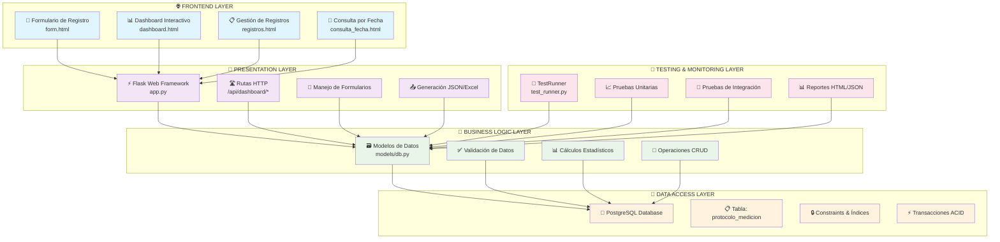
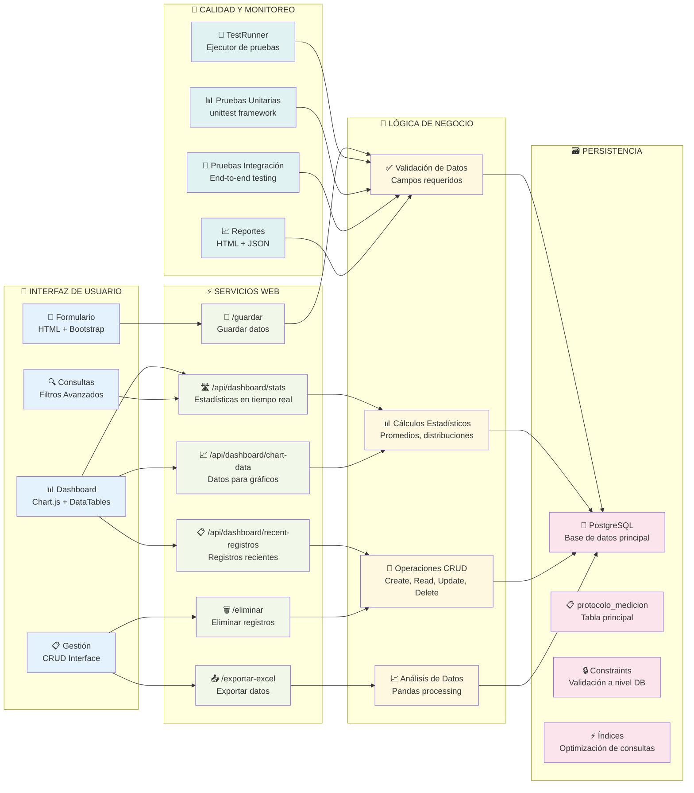
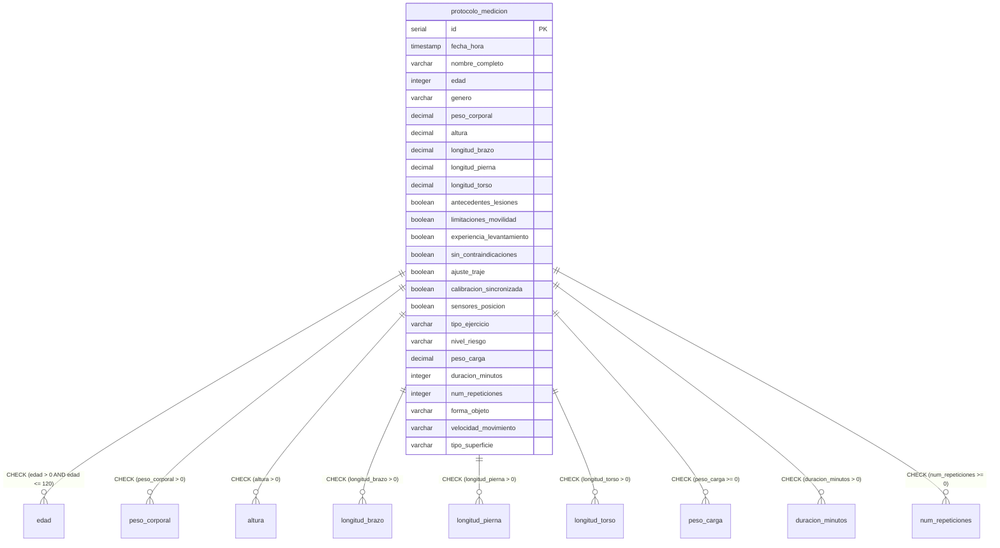
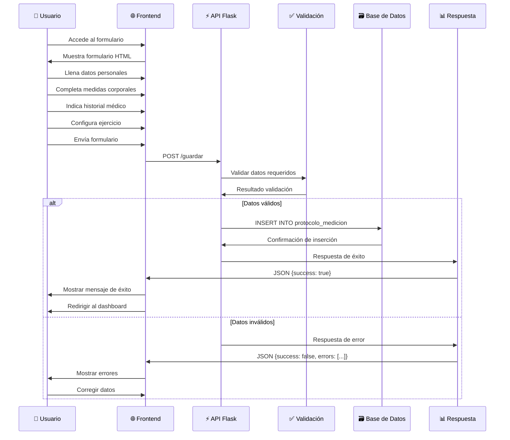
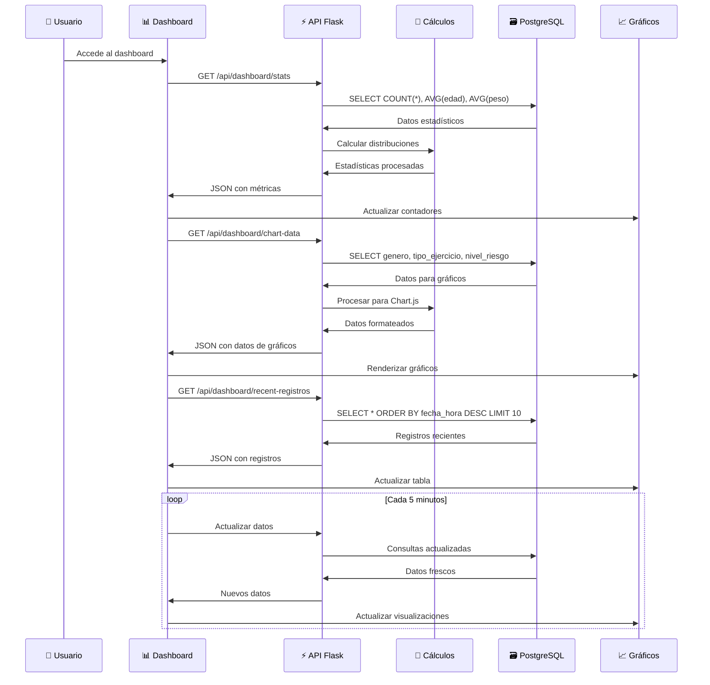
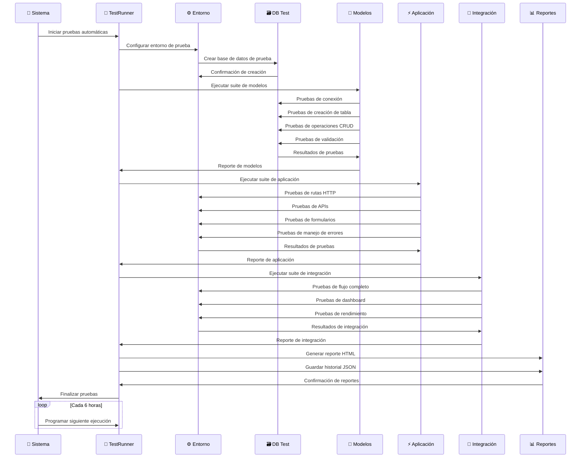
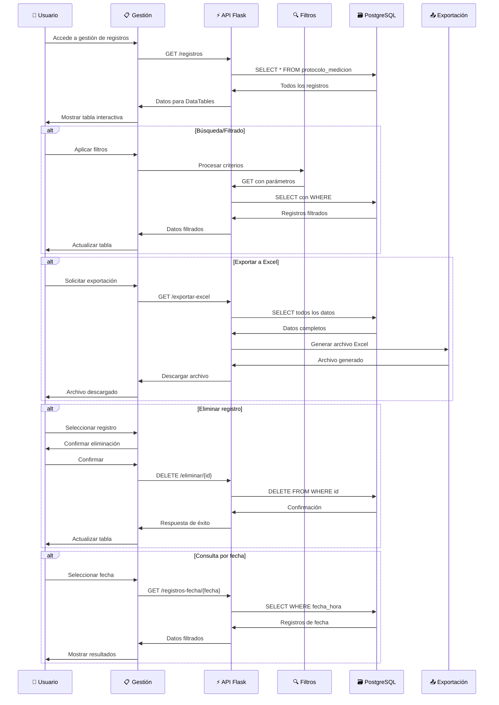
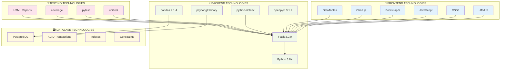
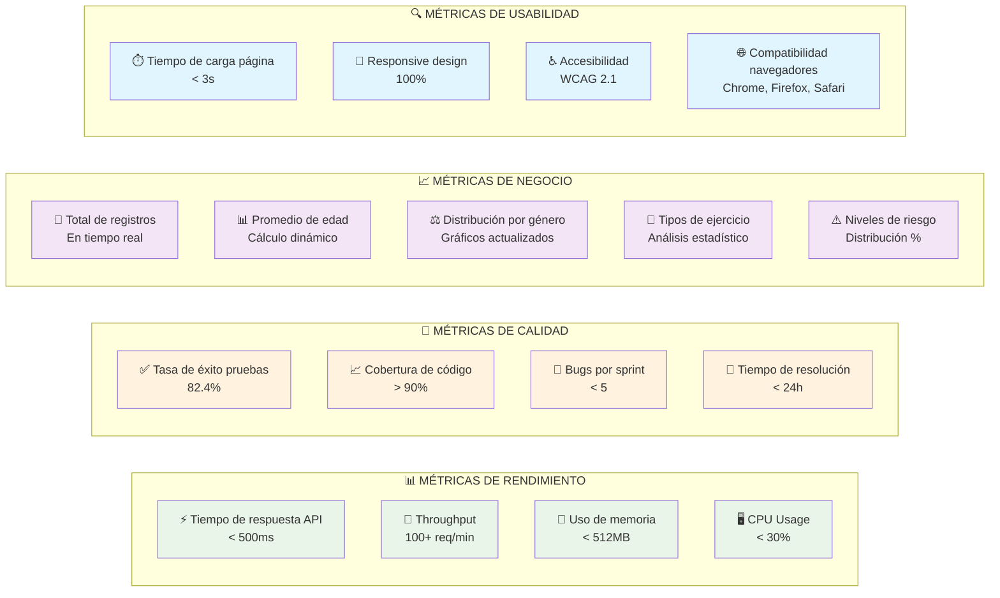

# 📐 Arquitectura del Sistema - Protocolo de Medición Dashboard

## 🏗️ Diagrama de Arquitectura General

## 🔧 Diagrama de Componentes Detallado

## 🗃️ Diagrama de Base de Datos

## 🔄 Flujos de Trabajo Detallados

### 1. Flujo de Registro de Datos

### 2. Flujo del Dashboard en Tiempo Real

### 3. Flujo de Pruebas Automatizadas

### 4. Flujo de Gestión de Datos

## 📊 Diagrama de Tecnologías y Dependencias

## 🎯 Métricas y KPIs del Sistema

---

## 📋 Resumen de Arquitectura

### **Principios de Diseño:**

- ✅ **Separación de Responsabilidades**: Cada capa tiene una función específica
- ✅ **Escalabilidad**: Arquitectura modular permite crecimiento
- ✅ **Mantenibilidad**: Código bien estructurado y documentado
- ✅ **Testabilidad**: Sistema de pruebas automatizado completo
- ✅ **Rendimiento**: Optimizaciones en base de datos y frontend
- ✅ **Seguridad**: Validación en múltiples capas

### **Ventajas de la Arquitectura:**

- 🚀 **Desarrollo Rápido**: Flask permite prototipado rápido
- 🔧 **Flexibilidad**: Fácil modificación y extensión
- 📊 **Monitoreo**: Sistema de pruebas y métricas integrado
- 🎨 **UX Moderna**: Interfaz responsiva y atractiva
- 💾 **Persistencia Robusta**: PostgreSQL con transacciones ACID
- 🧪 **Calidad Garantizada**: Testing automatizado continuo
