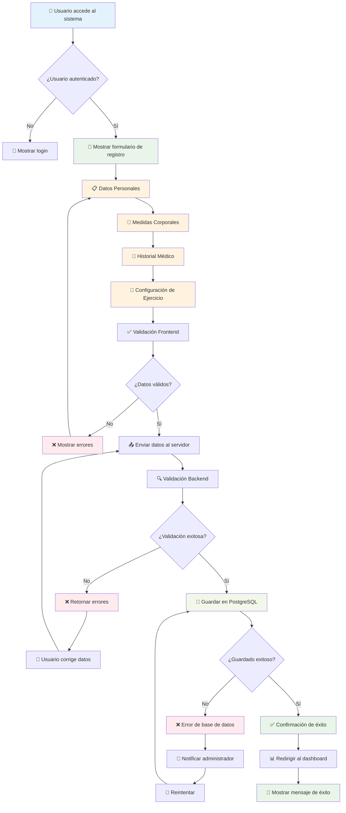
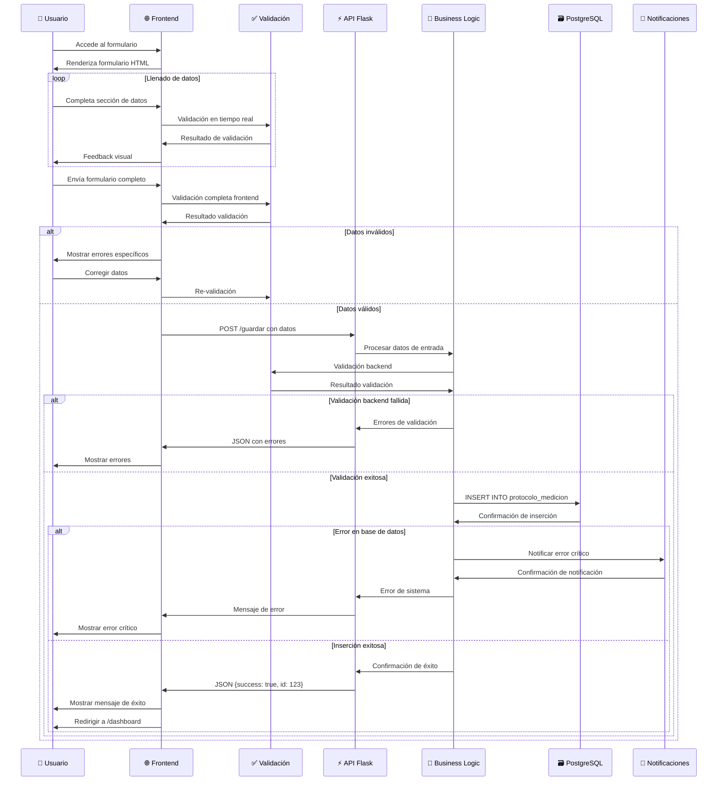
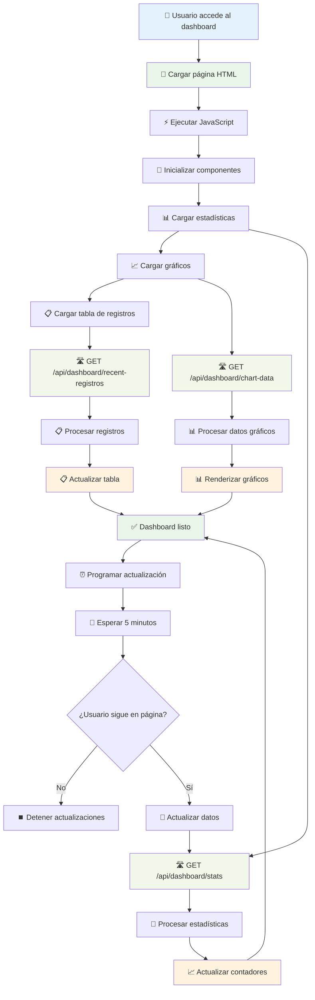
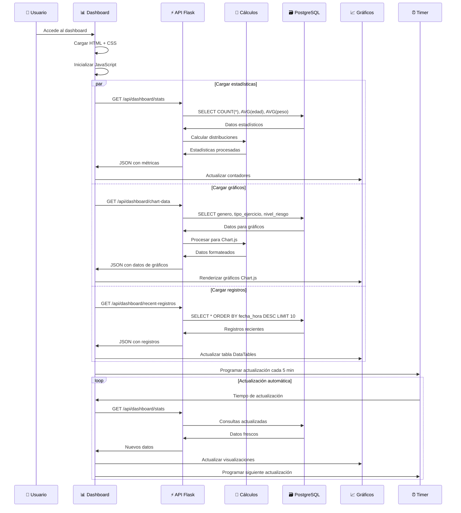
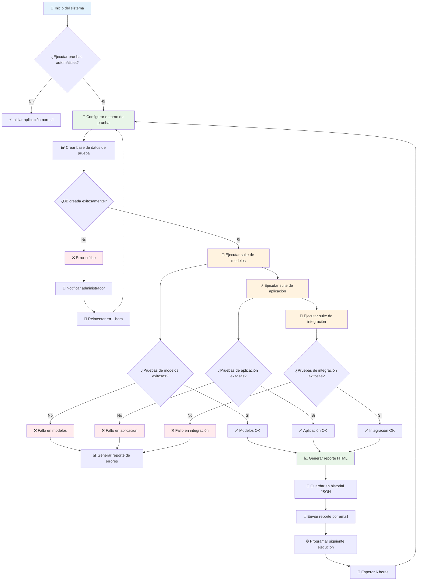
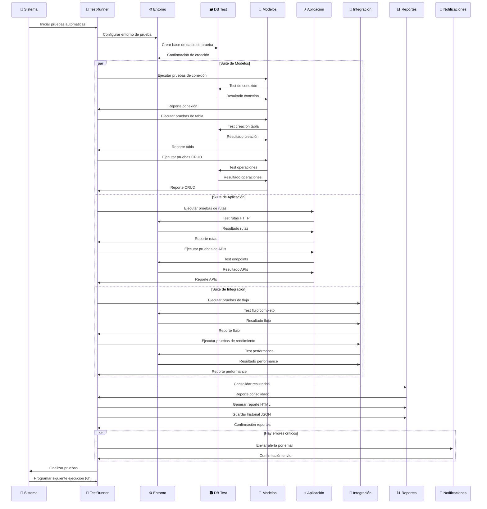
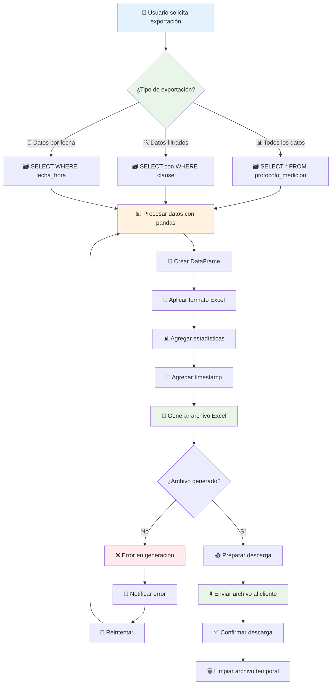
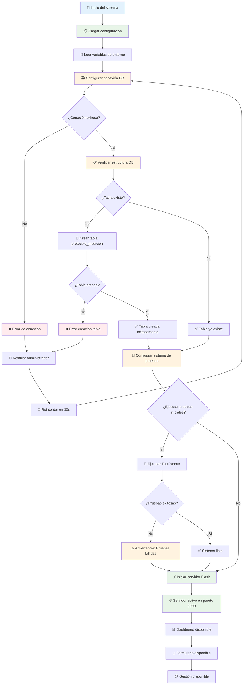

# 🔄 Flujos de Trabajo del Sistema - Protocolo de Medición Dashboard

## 📋 Índice de Flujos

1. [🔄 Flujo de Registro de Datos](#flujo-de-registro-de-datos)
2. [📊 Flujo del Dashboard en Tiempo Real](#flujo-del-dashboard-en-tiempo-real)
3. [🧪 Flujo de Pruebas Automatizadas](#flujo-de-pruebas-automatizadas)
4. [📋 Flujo de Gestión de Datos](#flujo-de-gestión-de-datos)
5. [🔍 Flujo de Consultas y Filtros](#flujo-de-consultas-y-filtros)
6. [📤 Flujo de Exportación de Datos](#flujo-de-exportación-de-datos)
7. [⚙️ Flujo de Configuración del Sistema](#flujo-de-configuración-del-sistema)

---

## 🔄 Flujo de Registro de Datos

### Diagrama de Flujo Principal



### Diagrama de Secuencia Detallado



---

## 📊 Flujo del Dashboard en Tiempo Real

### Diagrama de Flujo del Dashboard



### Diagrama de Secuencia del Dashboard



---

## 🧪 Flujo de Pruebas Automatizadas

### Diagrama de Flujo de Testing



### Diagrama de Secuencia de Testing



---

## 📋 Flujo de Gestión de Datos

### Diagrama de Flujo de Gestión

```mermaid
flowchart TD
    A[👤 Usuario accede a gestión] --> B[📋 Cargar todos los registros]
    B --> C[🛣️ GET /registros]
    C --> D[🗃️ Consultar PostgreSQL]
    D --> E[📊 Mostrar tabla DataTables]

    E --> F{Usuario selecciona acción}

    F -->|🔍 Buscar| G[📝 Aplicar filtros]
    G --> H[🛣️ GET con parámetros]
    H --> I[🗃️ SELECT con WHERE]
    I --> J[📊 Actualizar tabla filtrada]

    F -->|📤 Exportar| K[📄 Generar Excel]
    K --> L[🛣️ GET /exportar-excel]
    L --> M[🗃️ SELECT todos los datos]
    M --> N[📊 Procesar con pandas]
    N --> O[📄 Crear archivo Excel]
    O --> P[⬇️ Descargar archivo]

    F -->|🗑️ Eliminar| Q[⚠️ Confirmar eliminación]
    Q --> R{¿Confirmado?}
    R -->|No| S[❌ Cancelar operación]
    R -->|Sí| T[🛣️ DELETE /eliminar/{id}]
    T --> U[🗃️ DELETE FROM WHERE id]
    U --> V[✅ Confirmar eliminación]
    V --> W[📊 Actualizar tabla]

    F -->|📅 Consultar por fecha| X[📅 Seleccionar fecha]
    X --> Y[🛣️ GET /registros-fecha/{fecha}]
    Y --> Z[🗃️ SELECT WHERE fecha_hora]
    Z --> AA[📊 Mostrar registros de fecha]

    J --> BB[🔄 Volver a gestión]
    P --> BB
    W --> BB
    AA --> BB
    S --> BB

    style A fill:#e3f2fd
    style E fill:#e8f5e8
    style G fill:#fff3e0
    style K fill:#fff3e0
    style Q fill:#fff3e0
    style X fill:#fff3e0
    style BB fill:#e8f5e8
```

---

## 🔍 Flujo de Consultas y Filtros

### Diagrama de Flujo de Búsqueda

```mermaid
flowchart TD
    A[👤 Usuario inicia búsqueda] --> B[🔍 Mostrar panel de filtros]
    B --> C[📝 Usuario define criterios]

    C --> D[👤 Filtro por nombre]
    C --> E[📅 Filtro por fecha]
    C --> F[⚖️ Filtro por género]
    C --> G[🏃 Filtro por tipo ejercicio]
    C --> H[⚠️ Filtro por nivel riesgo]
    C --> I[📊 Filtro por rango edad]

    D --> J[🔄 Aplicar filtros]
    E --> J
    F --> J
    G --> J
    H --> J
    I --> J

    J --> K[🛣️ Construir query SQL]
    K --> L[🗃️ Ejecutar consulta]
    L --> M[📊 Procesar resultados]
    M --> N[📋 Mostrar resultados filtrados]

    N --> O{¿Resultados encontrados?}
    O -->|Sí| P[📊 Mostrar tabla con datos]
    O -->|No| Q[📭 Mostrar mensaje "Sin resultados"]

    P --> R[🔄 Opciones adicionales]
    Q --> R

    R --> S[📤 Exportar resultados]
    R --> T[🔄 Refinar búsqueda]
    R --> U[🗑️ Limpiar filtros]

    S --> V[📄 Generar Excel filtrado]
    T --> C
    U --> W[📊 Mostrar todos los registros]

    style A fill:#e3f2fd
    style B fill:#e8f5e8
    style J fill:#fff3e0
    style N fill:#e8f5e8
    style P fill:#e8f5e8
    style Q fill:#ffebee
    style V fill:#fff3e0
    style W fill:#e8f5e8
```

---

## 📤 Flujo de Exportación de Datos

### Diagrama de Flujo de Exportación



---

## ⚙️ Flujo de Configuración del Sistema

### Diagrama de Flujo de Configuración



---

## 📊 Resumen de Flujos

### **Flujos Principales del Sistema:**

1. **🔄 Registro de Datos**: Flujo completo desde formulario hasta base de datos
2. **📊 Dashboard en Tiempo Real**: Actualización automática de estadísticas
3. **🧪 Pruebas Automatizadas**: Sistema de testing continuo
4. **📋 Gestión de Datos**: Operaciones CRUD completas
5. **🔍 Consultas y Filtros**: Búsqueda avanzada de datos
6. **📤 Exportación**: Generación de reportes Excel
7. **⚙️ Configuración**: Inicialización del sistema

### **Características de los Flujos:**

- ✅ **Validación Multi-capa**: Frontend y Backend
- ✅ **Manejo de Errores**: Recuperación automática
- ✅ **Feedback en Tiempo Real**: Respuestas inmediatas
- ✅ **Persistencia Robusta**: Transacciones ACID
- ✅ **Monitoreo Continuo**: Testing automatizado
- ✅ **Escalabilidad**: Arquitectura modular
- ✅ **UX Optimizada**: Interfaz intuitiva
