# 📦 Diagramas de Bloque - Protocolo de Medición Dashboard

## 🎯 Diagramas de Bloque Sencillos

Este documento contiene diagramas de bloque simples y visuales que complementan la documentación técnica detallada.

### 📋 **Instrucciones de Visualización**

Para ver correctamente los diagramas Mermaid:
1. **GitHub/GitLab**: Los diagramas se renderizan automáticamente
2. **Editores Markdown**: Usar extensiones como "Mermaid Preview"
3. **Navegador**: Usar herramientas online como [mermaid.live](https://mermaid.live)
4. **VS Code**: Instalar extensión "Markdown Preview Mermaid Support"

---

## 🏗️ Diagrama de Bloque - Arquitectura General

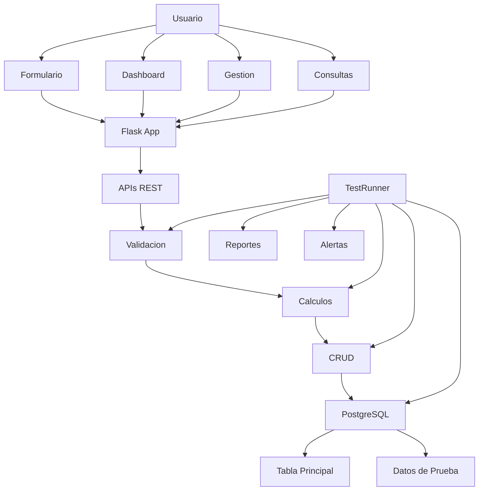

---

## 🔄 Diagrama de Bloque - Flujo de Datos

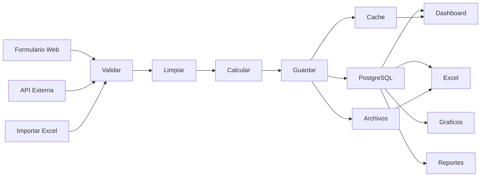

---

## 🏃 Diagrama de Bloque - Flujo de Registro

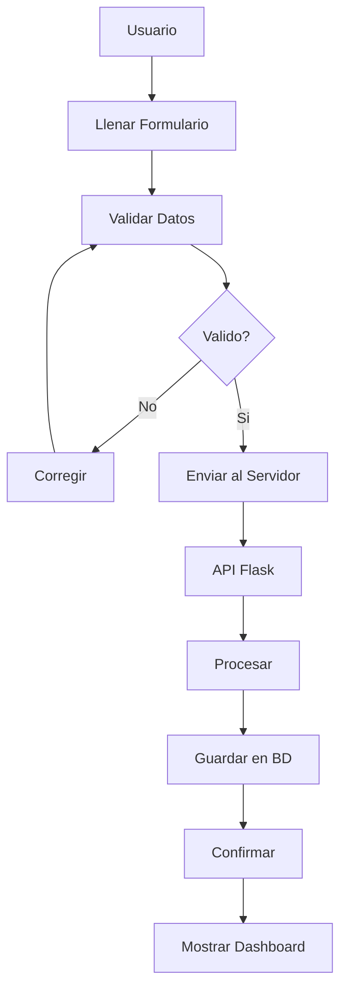

---

## 📊 Diagrama de Bloque - Flujo del Dashboard

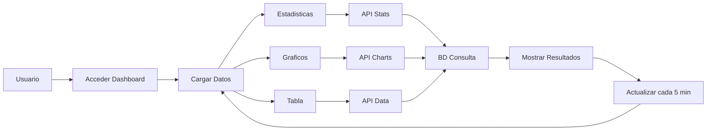

---

## 🧪 Diagrama de Bloque - Flujo de Testing

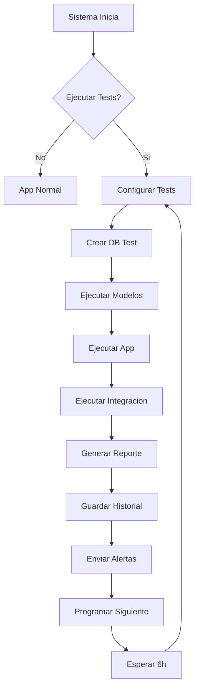

---

## 📋 Diagrama de Bloque - Gestión de Datos

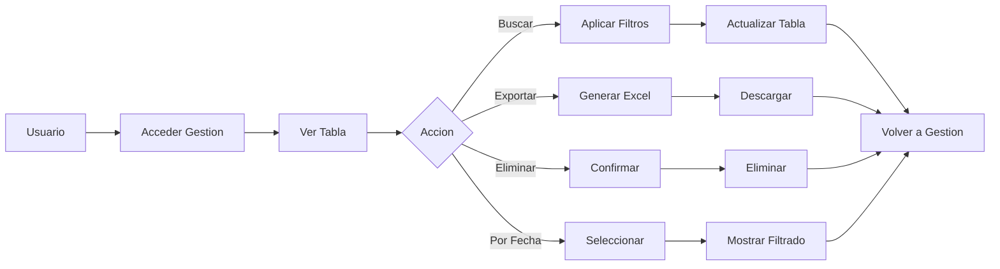

---

## 🔍 Diagrama de Bloque - Consultas y Filtros

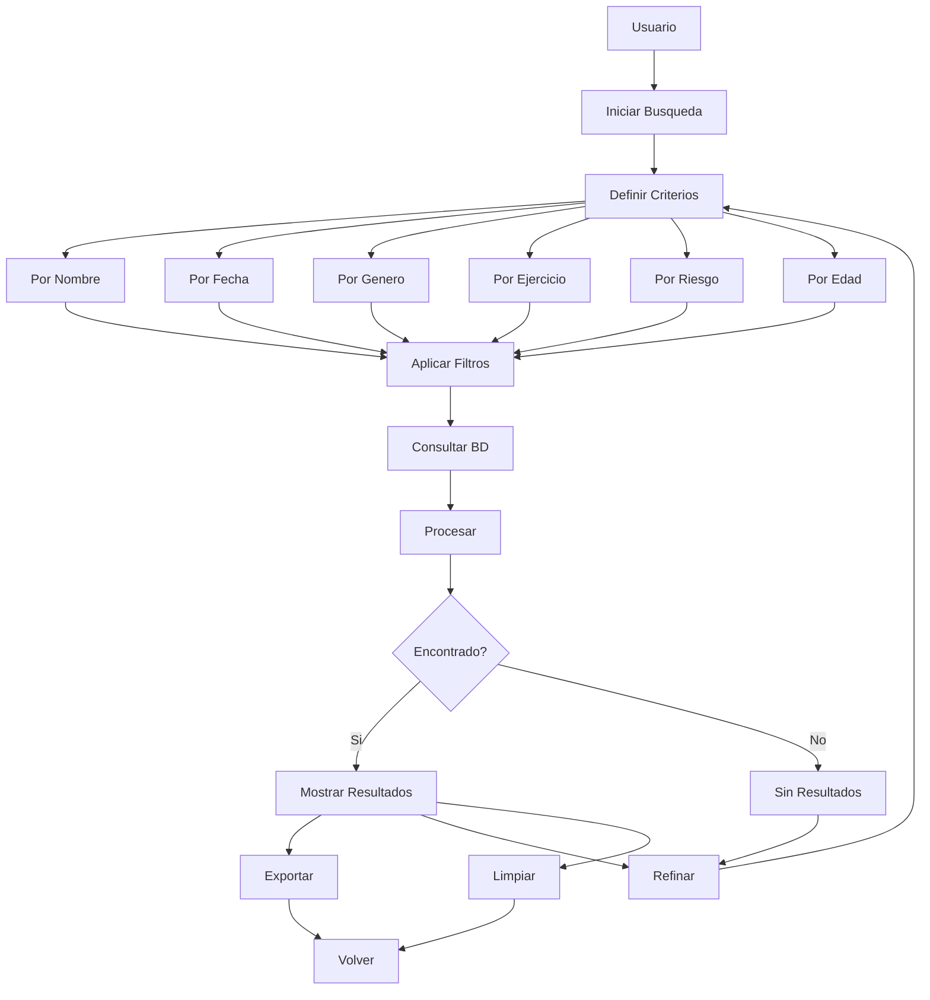

---

## 📤 Diagrama de Bloque - Exportación

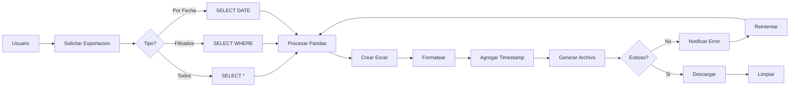

---

## ⚙️ Diagrama de Bloque - Configuración del Sistema

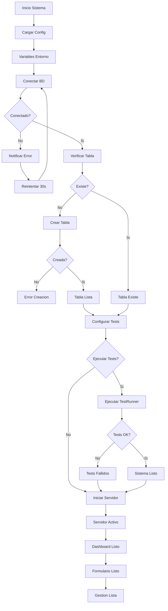

---

## 🎯 Diagrama de Bloque - Componentes del Sistema

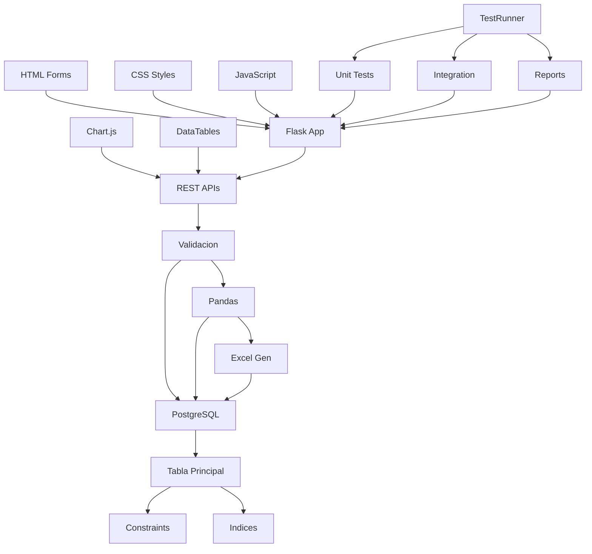

---

## 📊 Diagrama de Bloque - Flujo de Datos Simplificado

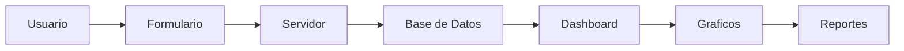

---

## 📋 Diagramas Alternativos (Texto)

### Arquitectura del Sistema (Texto)

```
┌─────────────────────────────────────────────────────────────────┐
│                        USUARIOS                                 │
├─────────────────────────────────────────────────────────────────┤
│  👤 Usuario Final  🔧 Administrador  🧪 Tester                 │
└─────────────────────────────────────────────────────────────────┘
                                │
                                ▼
┌─────────────────────────────────────────────────────────────────┐
│                      INTERFAZ WEB                               │
├─────────────────────────────────────────────────────────────────┤
│  📝 Formulario  📊 Dashboard  📋 Gestión  🔍 Consultas         │
└─────────────────────────────────────────────────────────────────┘
                                │
                                ▼
┌─────────────────────────────────────────────────────────────────┐
│                     SERVIDOR WEB                                │
├─────────────────────────────────────────────────────────────────┤
│  🛣️ Flask App  📡 APIs REST  📤 Generador Excel               │
└─────────────────────────────────────────────────────────────────┘
                                │
                                ▼
┌─────────────────────────────────────────────────────────────────┐
│                        LÓGICA                                   │
├─────────────────────────────────────────────────────────────────┤
│  ✅ Validación  📊 Cálculos  🔄 CRUD                           │
└─────────────────────────────────────────────────────────────────┘
                                │
                                ▼
┌─────────────────────────────────────────────────────────────────┐
│                        DATOS                                    │
├─────────────────────────────────────────────────────────────────┤
│  🐘 PostgreSQL  📋 Tabla Principal  📊 Datos de Prueba         │
└─────────────────────────────────────────────────────────────────┘
                                │
                                ▼
┌─────────────────────────────────────────────────────────────────┐
│                       TESTING                                   │
├─────────────────────────────────────────────────────────────────┤
│  🔬 TestRunner  📈 Reportes  📧 Alertas                         │
└─────────────────────────────────────────────────────────────────┘
```

### Flujo de Registro (Texto)

```
👤 Usuario
    │
    ▼
📝 Llenar Formulario
    │
    ▼
✅ Validar Datos
    │
    ▼
{ ¿Válido? }
    │
    ├─ ❌ No ──→ 🔧 Corregir ──→ ✅ Validar Datos
    │
    └─ ✅ Sí ──→ 📤 Enviar al Servidor
                    │
                    ▼
                🛣️ API Flask
                    │
                    ▼
                🧠 Procesar
                    │
                    ▼
                💾 Guardar en BD
                    │
                    ▼
                ✅ Confirmar
                    │
                    ▼
                📊 Mostrar Dashboard
```

### Flujo del Dashboard (Texto)

```
👤 Usuario
    │
    ▼
📊 Acceder Dashboard
    │
    ▼
🔄 Cargar Datos
    │
    ├─ 📈 Estadísticas ──→ 🛣️ API Stats ──→ 🗃️ BD Consulta
    ├─ 📊 Gráficos ──→ 🛣️ API Charts ──→ 🗃️ BD Consulta
    └─ 📋 Tabla ──→ 🛣️ API Data ──→ 🗃️ BD Consulta
    │
    ▼
📊 Mostrar Resultados
    │
    ▼
⏰ Actualizar cada 5 min ──→ 🔄 Cargar Datos
```

### Flujo de Testing (Texto)

```
🚀 Sistema Inicia
    │
    ▼
{ ¿Ejecutar Tests? }
    │
    ├─ ❌ No ──→ ⚡ App Normal
    │
    └─ ✅ Sí ──→ 🔧 Configurar Tests
                    │
                    ▼
                🗃️ Crear DB Test
                    │
                    ▼
                🧪 Ejecutar Modelos
                    │
                    ▼
                ⚡ Ejecutar App
                    │
                    ▼
                🔗 Ejecutar Integración
                    │
                    ▼
                📊 Generar Reporte
                    │
                    ▼
                💾 Guardar Historial
                    │
                    ▼
                📧 Enviar Alertas
                    │
                    ▼
                ⏰ Programar Siguiente
                    │
                    ▼
                🔄 Esperar 6h ──→ 🔧 Configurar Tests
```

---

## 🎯 Resumen de Diagramas de Bloque

### **Diagramas Incluidos:**

1. **🏗️ Arquitectura General**: Vista completa del sistema
2. **🔄 Flujo de Datos**: Procesamiento de información
3. **🏃 Flujo de Registro**: Proceso de ingreso de datos
4. **📊 Flujo del Dashboard**: Visualización en tiempo real
5. **🧪 Flujo de Testing**: Sistema de pruebas automatizado
6. **📋 Gestión de Datos**: Operaciones CRUD
7. **🔍 Consultas y Filtros**: Búsqueda avanzada
8. **📤 Exportación**: Generación de reportes
9. **⚙️ Configuración**: Inicialización del sistema
10. **🎯 Componentes**: Estructura técnica
11. **📊 Flujo Simplificado**: Vista general rápida

### **Características de los Diagramas:**

- ✅ **Simplicidad**: Fácil de entender a primera vista
- ✅ **Claridad**: Flujos lineales y lógicos
- ✅ **Completitud**: Cubren todos los procesos principales
- ✅ **Compatibilidad**: Funcionan en cualquier visor Mermaid
- ✅ **Alternativas**: Incluye diagramas en texto para máxima compatibilidad

### **Uso Recomendado:**

- **📖 Para Presentaciones**: Diagramas simples y claros
- **🎓 Para Capacitación**: Fácil comprensión para nuevos usuarios
- **📋 Para Documentación**: Referencia rápida de procesos
- **🔧 Para Desarrollo**: Vista general de componentes
- **📊 Para Stakeholders**: Explicación técnica simplificada

### **Solución de Problemas de Visualización:**

Si los diagramas Mermaid no se muestran correctamente:

1. **Copiar el código Mermaid** y pegarlo en [mermaid.live](https://mermaid.live)
2. **Usar los diagramas de texto** incluidos como alternativa
3. **Instalar extensiones** de Mermaid en tu editor
4. **Verificar compatibilidad** del visor Markdown

Estos diagramas complementan perfectamente la documentación técnica detallada existente, proporcionando una vista simplificada y visual de todos los procesos del sistema.
